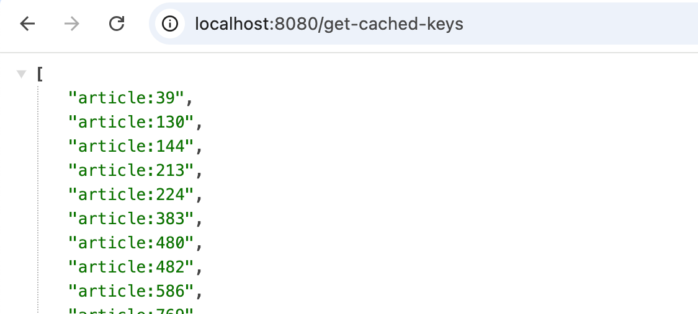
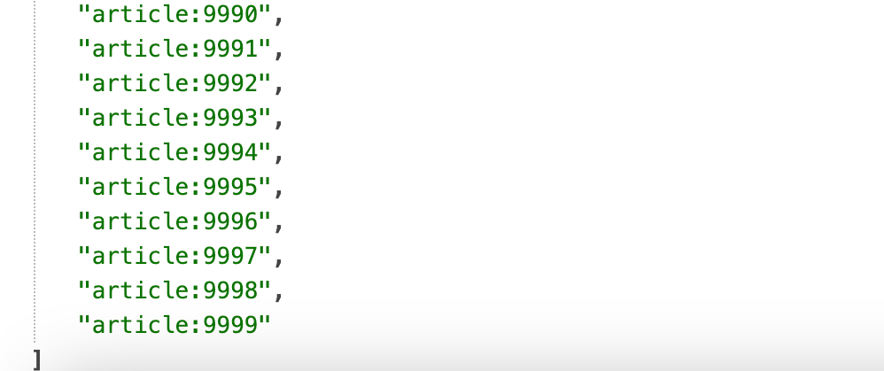
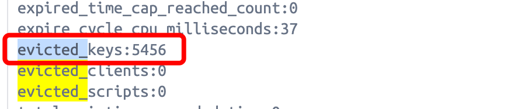

# Redis probabilistic cache and eviction modes

### Prepare your environment
1. Run `docker-compose up -d` to start the containers: redis master-slave cluster with sentinel and postgres database
2. Run the Spring Boot application that starts on port 8080

### Eviction modes
Eviction mode is set in the `docker-compose.yml` file along with a low `maxmemory` param in order to see the cache keys eviction when testing.
1. Call the endpoint http://localhost:8080/populate-cache - 10,000 entities will be cached to Redis, however, because the memory is not enough, some of them will be evicted
2. Call the endpoint http://localhost:8080/get-cached-keys
3. For example, in mode `allkeys-lru` we will observe that keys that were more early added will be removed from cache. The more recently added keep untouched. Also we can see the amount of evicted keys running command `redis-cli info stats`.
4. Try the same testing with other eviction policies




### Probabilistic cache
1. Run the `siege.sh` script and observe how before the key is about to expire we refresh it in the cache. 
````
   2024-09-01T17:35:23.969+03:00  INFO 21123 --- [redis-probabilistic-cache] [io-8080-exec-22] c.d.r.service.CacheService               : Article with id=[1] found in cache=[true]
   2024-09-01T17:35:23.969+03:00  INFO 21123 --- [redis-probabilistic-cache] [o-8080-exec-149] c.d.r.service.CacheService               : Article with id=[1] found in cache=[true]
   2024-09-01T17:35:24.011+03:00  INFO 21123 --- [redis-probabilistic-cache] [o-8080-exec-164] c.d.r.service.CacheService               : Article with id=[1] found in cache=[true]
   2024-09-01T17:35:24.022+03:00  INFO 21123 --- [redis-probabilistic-cache] [o-8080-exec-159] c.d.r.service.CacheService               : Article with id=[1] found in cache=[true]
   2024-09-01T17:35:24.023+03:00  INFO 21123 --- [redis-probabilistic-cache] [o-8080-exec-151] c.d.r.service.CacheService               : Article with id=[1] found in cache=[true]
   2024-09-01T17:35:24.023+03:00  INFO 21123 --- [redis-probabilistic-cache] [o-8080-exec-103] c.d.r.service.CacheService               : Article with id=[1] found in cache=[true]
   2024-09-01T17:35:24.023+03:00  INFO 21123 --- [redis-probabilistic-cache] [o-8080-exec-186] c.d.r.service.CacheService               : Article with id=[1] found in cache=[true]
   2024-09-01T17:35:24.030+03:00  INFO 21123 --- [redis-probabilistic-cache] [o-8080-exec-160] c.d.r.service.CacheService               : Article with id=[1] found in cache=[true]
   2024-09-01T17:35:24.030+03:00  INFO 21123 --- [redis-probabilistic-cache] [o-8080-exec-106] c.d.r.service.CacheService               : Article with id=[1] found in cache=[true]
   2024-09-01T17:35:24.030+03:00  INFO 21123 --- [redis-probabilistic-cache] [o-8080-exec-154] c.d.r.service.CacheService               : Article with id=[1] found in cache=[true]
   2024-09-01T17:35:24.030+03:00  INFO 21123 --- [redis-probabilistic-cache] [o-8080-exec-124] c.d.r.r.RedisArticleCacheRepository      : Article with id=[1] is about to expire and should refresh. Returning empty cache entity in order to get from database...
   2024-09-01T17:35:24.030+03:00  INFO 21123 --- [redis-probabilistic-cache] [o-8080-exec-136] c.d.r.r.RedisArticleCacheRepository      : Article with id=[1] is about to expire and should refresh. Returning empty cache entity in order to get from database...
   2024-09-01T17:35:24.030+03:00  INFO 21123 --- [redis-probabilistic-cache] [o-8080-exec-124] c.d.r.service.CacheService               : Article with id=[1] found in cache=[false]
   2024-09-01T17:35:24.030+03:00  INFO 21123 --- [redis-probabilistic-cache] [o-8080-exec-136] c.d.r.service.CacheService               : Article with id=[1] found in cache=[false]
   2024-09-01T17:35:24.030+03:00  INFO 21123 --- [redis-probabilistic-cache] [o-8080-exec-161] c.d.r.service.CacheService               : Article with id=[1] found in cache=[true]
   2024-09-01T17:35:24.030+03:00  INFO 21123 --- [redis-probabilistic-cache] [o-8080-exec-183] c.d.r.service.CacheService               : Article with id=[1] found in cache=[true]
   2024-09-01T17:35:24.030+03:00  INFO 21123 --- [redis-probabilistic-cache] [o-8080-exec-175] c.d.r.service.CacheService               : Article with id=[1] found in cache=[true]
   2024-09-01T17:35:24.168+03:00  INFO 21123 --- [redis-probabilistic-cache] [io-8080-exec-77] c.d.r.r.RedisArticleCacheRepository      : Saving article=[Article(id=1, name=teddy bear)] in cache...
   2024-09-01T17:35:24.168+03:00  INFO 21123 --- [redis-probabilistic-cache] [o-8080-exec-136] c.d.r.r.RedisArticleCacheRepository      : Saving article=[Article(id=1, name=teddy bear)] in cache...
   2024-09-01T17:35:24.169+03:00  INFO 21123 --- [redis-probabilistic-cache] [o-8080-exec-168] c.d.r.service.CacheService               : Article with id=[1] found in cache=[true]